Here is what my codebase looks like

```mermaid
graph TD
.[.] --> .[.]
.[.] --> LICENSE[LICENSE]
.[.] --> README.md[README.md]
.[.] --> docs[docs]
.-docs[./docs] --> first.png[first.png]
.[.] --> generate_mermaid_chart.sh[generate_mermaid_chart.sh]
.[.] --> helper_prompt.md[helper_prompt.md]
.[.] --> index.html[index.html]
.[.] --> mermaid_chart.md[mermaid_chart.md]
.[.] --> src[src]
.-src[./src] --> App.tsx[App.tsx]
.-src[./src] --> components[components]
.-src-components[./src/components] --> AutoResizingTextarea.tsx[AutoResizingTextarea.tsx]
.-src-components[./src/components] --> CodeHeader.tsx[CodeHeader.tsx]
.-src-components[./src/components] --> Header.tsx[Header.tsx]
.-src-components[./src/components] --> HtmlPreview.tsx[HtmlPreview.tsx]
.-src-components[./src/components] --> Markdown.tsx[Markdown.tsx]
.-src-components[./src/components] --> MermaidPreview.tsx[MermaidPreview.tsx]
.-src-components[./src/components] --> Message.css[Message.css]
.-src-components[./src/components] --> Message.tsx[Message.tsx]
.-src-components[./src/components] --> MessagesView.tsx[MessagesView.tsx]
.-src-components[./src/components] --> NewMessage.tsx[NewMessage.tsx]
.-src-components[./src/components] --> PreferencesModal.tsx[PreferencesModal.tsx]
.-src-components[./src/components] --> PromptForm.tsx[PromptForm.tsx]
.-src-components[./src/components] --> RevealablePasswordInput.tsx[RevealablePasswordInput.tsx]
.-src[./src] --> hooks[hooks]
.-src-hooks[./src/hooks] --> use-chat-openai.ts[use-chat-openai.ts]
.-src-hooks[./src/hooks] --> use-messages.ts[use-messages.ts]
.-src-hooks[./src/hooks] --> use-settings.tsx[use-settings.tsx]
.-src-hooks[./src/hooks] --> use-system-message.ts[use-system-message.ts]
.-src[./src] --> main.tsx[main.tsx]
.-src[./src] --> theme.ts[theme.ts]
.-src[./src] --> types.d.ts[types.d.ts]
.-src[./src] --> utils.ts[utils.ts]
.-src[./src] --> vite-env.d.ts[vite-env.d.ts]
.[.] --> yarn.lock[yarn.lock]
```



I want to `<Task: Add a way to pin a system message to a chat thread to send to gpt3 or 4. The app uses langchain>`

If you need to access any of the files within the codebase just say 

```bash
./find_and_format.sh <file>
```

and you will be given the file contents

Do not start without accessing any files. You should understand the codebase before attempting a solution.

You can only access 1 file per message, but in the conversation you give multiple messages to access multiple files.

Be comprehensive in your solution, you should make use you give a solution that fully solves the task.

For example, if it is a feature task you may want to not just update the logic, but also give UI update solutions.

If it is a backend, you may want to update the endpoint, routers, models, migrations, etc.
